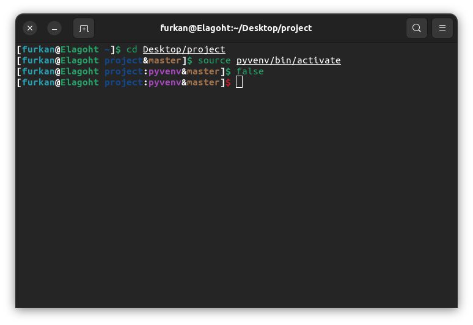

# Bash Plus Oh My Zsh Theme


This theme is made to look like the default `bash` prompt, but colored. It also supports displaying virtual environments and `git` status.

# Installation

Here is a one-liner command for installation.
```bash
curl -sfSL "https://raw.githubusercontent.com/Elagoht/BashPlusZshTheme/main/install.sh" | bash
```

# Screenshot


